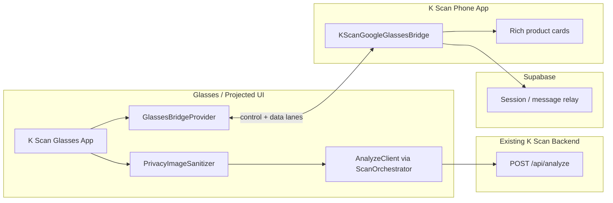

# Architecture — K Scan Google Glasses

## System context



## Glasses projected app

The Android module under `android-xr/` is designed as a **projected / companion** experience:

- Primary UI: Jetpack Compose, 600×600 safe viewport, dark high-contrast theme
- Runtime selects `GoogleBridgeProvider` or `MockBridgeProvider` via `KScanApplication`
- **Display glasses:** render top-3 result cards on-device
- **Audio-only glasses:** voice summary + push rich cards to phone via bridge

Jetpack Projected and Android XR entry points are **explicit TODOs** in `GoogleBridgeProvider` — API surfaces are version-sensitive.

## Phone bridge

`phone-bridge/` runs inside the existing K Scan React Native app:

- Maintains pairing/session with glasses projected context
- Relays auth session (`AUTH_SESSION`) without logging tokens
- Handles `CAPTURE_PHOTO` when glasses have no camera
- Opens product URLs on phone (`OPEN_ON_PHONE`)
- Receives `ANALYSIS_RESULT` for full product shelf on phone

## Backend

Unchanged contract:

```
POST https://kscan-app-1.onrender.com/api/analyze
{ "image": "<base64>" }
```

Images are sanitized **before** this call. No contract changes in this repo.

## Supabase

Used as optional **session and message relay** between glasses projected runtime and phone app:

- Not required for mock mode
- `SupabaseSyncClient` (Android) and `SupabaseSessionRelay` (TS) are stubs
- Do not store face metadata or raw images in Supabase

## Control lane vs data lane

| Lane | Contents | Transport |
|------|----------|-----------|
| **Control** | HELLO, DEVICE_STATE, PERMISSIONS, ANALYSIS_STARTED, SAVE_ITEM, OPEN_ON_PHONE, ERROR | Bluetooth bridge / Supabase realtime / compact JSON |
| **Data** | Photo bytes, large analysis payloads | Wi-Fi transfer when available; else compressed bridge fallback |

`DeviceCapabilities.supportsWifiTransfer` gates large payload paths. Missing capability never crashes — fallback is always attempted.

## Display glasses vs audio-only

| Capability | Display glasses | Audio-only |
|------------|-----------------|------------|
| Results UI | Top 3 cards on glasses | Voice summary only |
| Product detail | Focus + Select on glasses | `sendToPhone` + `openOnPhone` |
| Navigation | D-pad / gesture + voice | Voice + phone UI |
| Preview | Optional `startPreview` | N/A |

Detection via `DeviceCapabilities.hasDisplay` at runtime (mock toggles in Settings for alpha).

## Provider abstraction

All hardware access goes through `GlassesBridgeProvider`:

- `GoogleBridgeProvider` — production path (stubs)
- `MockBridgeProvider` — local alpha
- Future `MetaBridgeProvider` — same interface, different OEM SDK

## Privacy boundary

Upload path: `capture → sanitize (strict) → analyze`. See [PRIVACY_PIPELINE.md](PRIVACY_PIPELINE.md).
